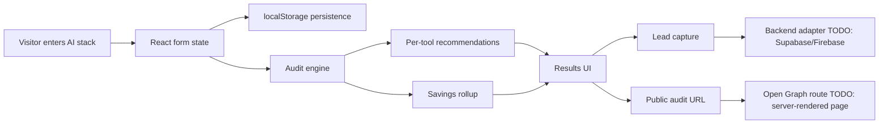

# Architecture

## Data Flow

The user enters team size, primary use case, and one row per paid AI tool. The form is saved to localStorage on every change. On submit, `auditSpend` evaluates each row using pricing data and deterministic rules for plan fit, cheaper same-vendor options, cheaper use-case alternatives, and Credex credit opportunities. The result is saved under a unique audit id and shown in the results panel.

## Stack Choice

I chose React with TypeScript and Vite because the MVP is mostly interaction-heavy UI plus a rules engine. React keeps the product easy to compose, TypeScript protects the audit data model, and Vite keeps development and deployment simple. If Open Graph previews become a hard requirement in production, I would move the app to Next.js or add a small server route that renders public audit metadata from stored audit records.

## 10k Audits Per Day

At 10k audits/day, localStorage needs to become a real backend. I would store audits and leads in Postgres or Supabase, add server-side rate limiting by IP and email hash, render public audit pages server-side for share previews, queue transactional emails, and cache pricing data with a reviewed update process. The audit engine can stay stateless and run on the server or client because it is deterministic and cheap.
